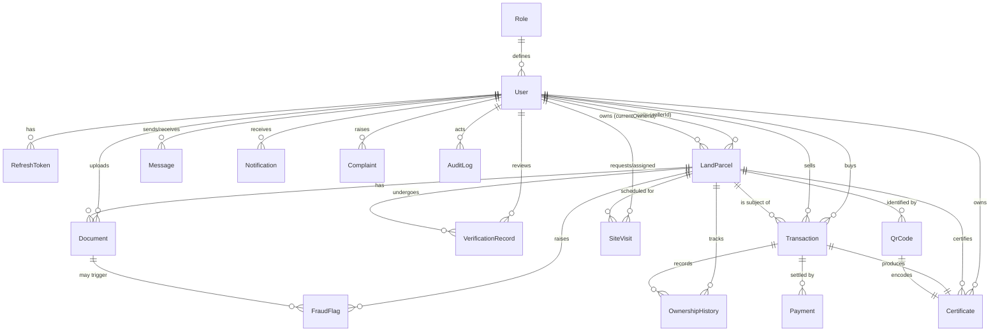

# Entity Relationship Diagram (ERD)
## LandGuard Kenya

The data model has **17 entities**. Relationships are shown below in Mermaid
(renders on GitHub) followed by a cardinality summary.

## Cardinality summary

| Relationship | Type | Notes |
|--------------|------|-------|
| Role → User | 1 : N | Role name (BUYER/SELLER/ADMIN/GOVERNMENT_OFFICER/SURVEYOR) |
| User → LandParcel (seller) | 1 : N | A seller lists many parcels |
| User → LandParcel (owner) | 1 : N | Current owner of a parcel |
| LandParcel → Document | 1 : N | Title deed, survey map, ID, etc. |
| LandParcel → VerificationRecord | 1 : N | One record per verification stage |
| LandParcel → Transaction | 1 : N | Multiple offers over time |
| Transaction → Payment | 1 : N | Retries / partial history |
| Transaction → Certificate | 1 : 1 | Issued on settlement |
| LandParcel → OwnershipHistory | 1 : N | Full chain of custody |
| LandParcel / Document / User → FraudFlag | 1 : N | Weighted fraud signals |
| LandParcel / Certificate → QrCode | 1 : 1 | Signed verification token |
| User → AuditLog | 1 : N | Immutable action trail |

## Key design decisions
1. **No hard DB uniqueness on `parcelNumber` / `titleDeedNumber`.** Duplicates are
   exactly what the fraud engine must catch, so submissions are stored and screened;
   the workflow blocks fraudulent listings rather than the database rejecting the row.
2. **Single `User` table with a `role` discriminator** rather than separate
   Buyer/Seller/Officer tables — simpler joins, one identity, RBAC via role + permissions.
3. **Enumerations modelled as validated `String` columns** so the identical schema
   runs on SQLite (dev) and PostgreSQL (prod) with no dialect-specific enum types.
4. **`OwnershipHistory` + `Certificate`** give an auditable, verifiable chain of title.
